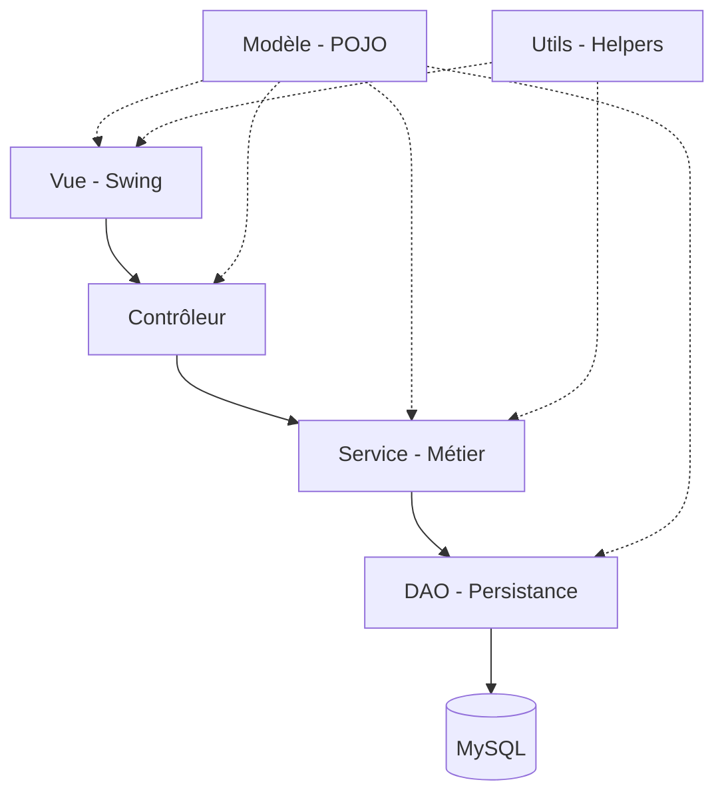

# 🏗️ Documentation Technique — Gestion Restaurant

## Architecture

L'application repose sur une architecture en **4 couches logiques** (N-Tier) appuyée par des packages transversaux :



| Type | Couche / Package | Rôle |
|---|---|---|
| **Logique** | `com.restaurant.view` | Interface Swing (Vue), affichage uniquement |
| **Logique** | `com.restaurant.controller` | Orchestration, validation IHM, lien Vue-Service |
| **Logique** | `com.restaurant.service` | Logique métier pure, gestion des transactions |
| **Logique** | `com.restaurant.dao` | Accès aux données (CRUD), requêtes SQL |
| **Support** | `com.restaurant.model` | Entités (POJO), Enums, transport de données |
| **Support** | `com.restaurant.utils` | Design System, utilitaires (Dates, Validation) |

---

### Modèle Relationnel (Mise à jour)

```sql
CATEGORIE  (id_cat, libelle_cat)
PRODUIT    (id_pro, nom_pro, id_cat→CATEGORIE, prix_vente, stock_actu, seuil_alerte)
UTILISATEUR(id_uti, nom_util, mdp, role)
COMMANDE   (id_cmde, date, etat, total, nom_util)
LIGNE_COMMANDE(id_lig, id_cmde→COMMANDE, id_pro→PRODUIT, qte_lig, prix_unit)
MVT_STOCK  (id_mvt, id_pro→PRODUIT, type, quantite, date, motif, reference)
```
> [!NOTE]
> Les noms de colonnes `nom_util` et `date` ont été standardisés. La table de stock est nommée `MVT_STOCK`.

---

## Transactions SQL

`CommandeService.validerCommande()` utilise `setAutoCommit(false)` / `commit()` / `rollback()` pour garantir l'atomicité de :
1. la déduction du stock sur chaque ligne,
2. l'enregistrement du mouvement de stock,
3. le changement d'état de la commande (`EN_COURS → VALIDEE`).

En cas d'erreur (stock insuffisant, etc.), l'ensemble est annulé (`rollback`).

---

## Gestion des exceptions

- Les méthodes DAO et Service déclarent `throws SQLException` (exception spécifique).
- Les contrôleurs capturent `SQLException` et `NumberFormatException` séparément.
- `ProduitDAO.ProduitLieACommandeException` (classe imbriquée statique) est levée lorsqu'une suppression de produit viole la contrainte de clé étrangère MySQL (erreur 1451).

---

## Design System (`DesignSystem.java`)

Point unique pour toutes les couleurs (`PRIMARY`, `DANGER`, `WARNING`, …) et polices (`FONT_TITLE`, `FONT_BODY`, `FONT_BUTTON`, `FONT_BADGE`, `FONT_HUGE`). Méthodes utilitaires : `styleButton()`, `styleTextField()`, `createCard()`, `createBadge()`.

---

---
 
 ## Optimisation des performances
 
 Pour garantir une interface fluide, toutes les opérations d'accès à la base de données (chargement des produits, catégories, statistiques) sont déportées dans des threads d'arrière-plan via `javax.swing.SwingWorker`. 
 
 - **Cursor Feedback** : Le curseur système bascule en mode "WAIT" (sablier) pendant le travail en tâche de fond.
 - **Non-blocking refresh** : Les listes déroulantes et tableaux se mettent à jour de manière asynchrone après chaque transaction.
 
 ---
 
 ## Migration Automatique (`DatabaseUpdater.java`)
 
 Au démarrage (`Main.java`), une classe utilitaire inspecte la structure de la base :
 - Elle tente de renommer les anciennes colonnes (ex: `nomUtil` → `nom_util`).
 - Elle ajoute les colonnes manquantes (ex: `reference` dans `MVT_STOCK`).
 - Elle assure que la version de la base est cohérente avec la version du code déployée.
 
 ---
 
 ## Sauvegarde & Restauration SQL

Le module de continuité système repose sur la classe `DatabaseBackupService`. 
- **Export** : Exécute de manière asynchrone la commande `mysqldump` native du système pour générer un fichier `.sql` contenant le schéma structuré et les insertions (`INSERT`) complètes de la base de données.
- **Import** : Exploite l'exécutable `mysql` pour sourcer et écraser la base courante à partir d'un fichier `.sql` de sauvegarde.
- **ProcessBuilder** : La communication avec le shell système (`bash` pour Linux/Unix ou `cmd.exe` pour Windows) est gérée dynamiquement en détectant `os.name`. Les erreurs (ErrorStream) sont lues et renvoyées à la vue.

---

## Logging

Log4j2 est configuré via `log4j2.xml`. Les logs sont écrits dans `logs/app.log`. Les accès non autorisés et les erreurs métier sont tracés.

---

## Sécurité

- Mots de passe hashés en **BCrypt** (via `UtilisateurDAO`).
- Rôles vérifiés à la connexion ; le `MainView` masque les boutons en fonction du rôle.
- Déconnexion automatique après 10 min d'inactivité (`javax.swing.Timer` + `AWTEventListener`).

---

## Dépendances externes (`/lib`)

| JAR | Usage |
|---|---|
| `jfreechart-1.5.3.jar` | Graphiques dashboard |
| `itextpdf-5.5.13.3.jar` | Export PDF |
| `log4j-api-2.19.0.jar` + `log4j-core-2.19.0.jar` | Logging |

---

## Configuration

`config.properties` (non versionné, à créer localement) :
```properties
db.url=jdbc:mysql://localhost:3306/gestion_restaurant
db.user=root
db.password=votre_mot_de_passe
```

Chargé au démarrage par `ConnectionDB.java`.
